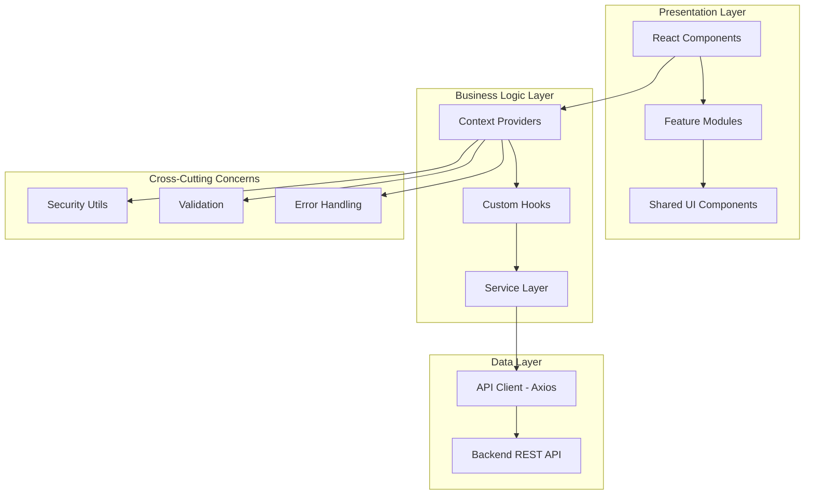
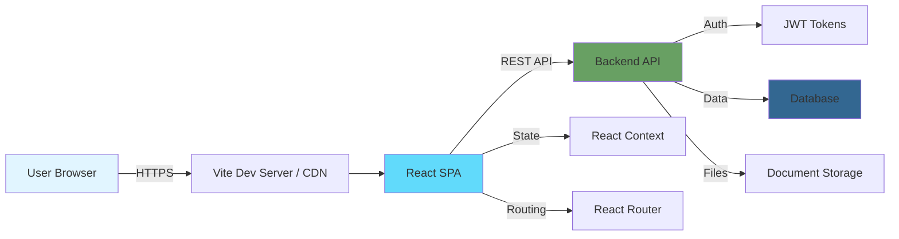

# 🏭 Electronic Quality Management System (eQMS)

> A comprehensive, enterprise-grade Quality Management System built with React, TypeScript, and modern web technologies for pharmaceutical, manufacturing, and regulated industries.

[](https://www.typescriptlang.org/)
[](https://reactjs.org/)
[](https://vitejs.dev/)
[](./LICENSE)

---

## 📋 Table of Contents

- [Introduction](#-introduction)
- [Key Features](#-key-features)
- [Architecture Overview](#-architecture-overview)
- [Tech Stack](#-tech-stack)
- [Getting Started](#-getting-started)
- [Environment Configuration](#-environment-configuration)
- [Project Structure](#-project-structure)
- [Development Guide](#-development-guide)
- [Contributing](#-contributing)
- [Roadmap](#-roadmap)
- [License](#-license)

---

## 🎯 Introduction

**eQMS** is a modern, web-based Quality Management System designed to help organizations comply with regulatory requirements (FDA 21 CFR Part 11, ISO 9001, GMP) while streamlining quality processes across document control, training, deviations, CAPA, change control, and more.

### Why eQMS?

- ✅ **Regulatory Compliance**: Built-in support for electronic signatures, audit trails, and controlled documents
- ✅ **User-Friendly**: Intuitive interface designed with Tailwind CSS and shadcn/ui components
- ✅ **Scalable**: Modular architecture supporting multi-site, multi-department operations
- ✅ **Secure**: Advanced security features including encryption, CSRF protection, and role-based access control
- ✅ **Real-Time**: Live notifications, task management, and collaborative workflows

---

## ✨ Key Features

### 📄 Document Control System
- **Document Lifecycle Management**: Draft → Review → Approval → Effective → Archive
- **Version Control**: Automated revision tracking with full audit history
- **Controlled Copies**: Distribution management with recall capabilities
- **Electronic Signatures**: Multi-level approval workflows with digital signatures
- **Document Relationships**: Link related documents, SOPs, and work instructions

### 🎓 Training Management
- **Course Management**: Create, assign, and track training courses
- **Competency Assessment**: Quiz integration with pass/fail criteria
- **Training Records**: Automated certificates and compliance reporting
- **Scheduled Retraining**: Configurable training intervals with notifications

### ⚠️ Quality Event Management
- **Deviation & Non-Conformances**: Investigate, document, and resolve quality issues
- **CAPA (Corrective & Preventive Actions)**: Root cause analysis and effectiveness checks
- **Change Control**: Risk-assessed change management with approval workflows
- **Complaints Management**: Customer complaint tracking and trending analysis

### 🔍 Audit Trail System
- **Comprehensive Logging**: Every action is tracked with user, timestamp, and reason
- **Tamper-Proof**: Immutable audit records with cryptographic integrity
- **Advanced Filtering**: Search by user, date, action type, or affected records
- **Compliance Reports**: Pre-built reports for regulatory inspections

### 👥 User & Access Management
- **Role-Based Access Control (RBAC)**: Admin, QA Manager, Document Owner, Reviewer, Approver, Viewer
- **Department & Business Unit**: Hierarchical organization structure
- **Multi-Factor Authentication**: Optional 2FA for enhanced security
- **Session Management**: Secure token-based authentication with auto-refresh

### 📊 Reports & Analytics
- **Dashboard Widgets**: Real-time KPIs and metrics visualization
- **Custom Reports**: Filter, sort, and export data to Excel/PDF
- **Trend Analysis**: Deviation rates, CAPA effectiveness, training compliance
- **Regulatory Reports**: Pre-formatted reports for FDA, ISO audits

---

## 🏗️ Architecture Overview

eQMS follows a **modular, feature-based architecture** with clear separation of concerns:



### System Architecture



### Component Hierarchy

```
App (Root)
├── AuthProvider (Authentication State)
├── ThemeProvider (UI Theme)
├── NotificationProvider (Alerts & Toasts)
└── AppRoutes
    ├── PublicRoutes (Login, Forgot Password)
    └── ProtectedRoutes (Requires Authentication)
        ├── MainLayout (Header, Sidebar, Footer)
        │   ├── Dashboard
        │   ├── My Tasks
        │   ├── Notifications
        │   └── Feature Modules
        │       ├── Documents
        │       ├── Training
        │       ├── Deviations
        │       ├── CAPA
        │       ├── Change Control
        │       └── Settings
        └── ErrorBoundary (Error Handling)
```

---

## 🛠️ Tech Stack

### Core Technologies

| Technology | Version | Purpose |
|------------|---------|---------|
| **React** | 19.2.3 | UI framework |
| **TypeScript** | 5.8.2 | Type-safe JavaScript |
| **Vite** | 6.2.0 | Build tool & dev server |
| **React Router** | 7.11.0 | Client-side routing |
| **Tailwind CSS** | Latest | Utility-first CSS |

### UI Libraries

- **Lucide React** - Icon library (500+ icons)
- **Tabler Icons** - Additional icon set
- **Recharts** - Data visualization & charts
- **Framer Motion** - Animation library
- **shadcn/ui** - Headless UI components (custom implementation)

### Document Processing

- **React PDF** - PDF viewing & rendering
- **PDF.js** - PDF parsing & manipulation
- **Mammoth** - Word document (.docx) preview
- **React Easy Crop** - Image cropping for avatars

### Development Tools

- **Axios** - HTTP client for API calls
- **Puppeteer** - Headless browser for testing/PDF generation
- **TypeScript ESLint** - Code quality & linting

---

## 🚀 Getting Started

### Prerequisites

- **Node.js** >= 18.0.0
- **npm** >= 9.0.0 or **yarn** >= 1.22.0
- **Git** for version control

### Installation

1. **Clone the repository**

```bash
git clone https://github.com/your-org/eqms.git
cd eqms
```

2. **Install dependencies**

```bash
npm install
# or
yarn install
```

3. **Configure environment variables**

Create a `.env` file in the root directory (see [Environment Configuration](#-environment-configuration)):

```bash
cp .env.example .env
```

4. **Start development server**

```bash
npm run dev
# or
yarn dev
```

5. **Open your browser**

Navigate to [http://localhost:3000](http://localhost:3000)

### Demo Credentials

For testing purposes, use:

- **Username**: `admin`
- **Password**: `123456`

> ⚠️ **Security Notice**: Change default credentials in production environments!

---

## ⚙️ Environment Configuration

Create a `.env` file in the root directory with the following variables:

```bash
# API Configuration
VITE_API_BASE_URL=http://localhost:8080/api
VITE_API_TIMEOUT=30000

# Authentication
VITE_JWT_SECRET=your-super-secret-jwt-key-change-in-production
VITE_TOKEN_EXPIRY=604800  # 7 days in seconds

# Security
VITE_ENCRYPTION_KEY=EQMS_SECRET_KEY_2026_CHANGE_THIS
VITE_CSRF_ENABLED=true

# Feature Flags
VITE_ENABLE_DEMO_MODE=true
VITE_ENABLE_ANALYTICS=false

# AI Integration (Optional)
GEMINI_API_KEY=your-gemini-api-key-here

# File Upload
VITE_MAX_FILE_SIZE=10485760  # 10MB in bytes
VITE_ALLOWED_FILE_TYPES=pdf,docx,xlsx,png,jpg

# Email Configuration (Backend)
VITE_SMTP_HOST=smtp.example.com
VITE_SMTP_PORT=587
VITE_SMTP_USER=noreply@yourcompany.com
```

### Environment Variables Reference

| Variable | Description | Default |
|----------|-------------|---------|
| `VITE_API_BASE_URL` | Backend API endpoint | `http://localhost:8080/api` |
| `VITE_ENCRYPTION_KEY` | Encryption key for local storage | (none) |
| `VITE_ENABLE_DEMO_MODE` | Enable demo login without backend | `true` |
| `GEMINI_API_KEY` | Google Gemini API for AI features | (optional) |

> 💡 **Tip**: All `VITE_*` prefixed variables are exposed to the client. Never store sensitive backend secrets here!

---

## 📁 Project Structure

```
eqms/
├── public/                      # Static assets
│   └── icons/                   # App icons & favicons
├── src/
│   ├── app/                     # App initialization
│   │   ├── App.tsx              # Root component
│   │   ├── routes.tsx           # Route definitions
│   │   ├── navigation.ts        # Navigation config
│   │   └── constants.tsx        # Global constants
│   ├── assets/                  # Images, fonts, etc.
│   │   └── images/
│   ├── components/              # Reusable components
│   │   ├── layout/              # Layout components
│   │   │   ├── Header/
│   │   │   ├── Sidebar/
│   │   │   ├── Footer/
│   │   │   └── MainLayout/
│   │   └── ui/                  # UI component library
│   │       ├── button/          # Button component
│   │       ├── select/          # Select dropdown
│   │       ├── modal/           # Modal dialogs
│   │       ├── table/           # Table components
│   │       ├── checkbox/        # Checkbox component
│   │       └── ...              # Other UI components
│   ├── contexts/                # React Context providers
│   │   ├── AuthContext.tsx      # Authentication state
│   │   ├── ThemeContext.tsx     # Theme management
│   │   └── NotificationContext.tsx
│   ├── features/                # Feature modules
│   │   ├── auth/                # Authentication
│   │   ├── dashboard/           # Dashboard widgets
│   │   ├── documents/           # Document Control
│   │   │   ├── document-list/
│   │   │   ├── document-detail/
│   │   │   ├── document-revisions/
│   │   │   ├── controlled-copies/
│   │   │   └── archived-documents/
│   │   ├── training/            # Training Management
│   │   ├── deviations/          # Deviations & NCs
│   │   ├── capa/                # CAPA Management
│   │   ├── change-control/      # Change Controls
│   │   ├── my-tasks/            # Task Management
│   │   ├── notifications/       # Notifications
│   │   ├── audit-trail/         # Audit Trail
│   │   └── settings/            # System Settings
│   │       ├── user-management/
│   │       ├── user-profile/
│   │       └── ...
│   ├── hooks/                   # Custom React hooks
│   │   ├── useApi.ts
│   │   ├── usePagination.ts
│   │   ├── useDebounce.ts
│   │   └── useSecurity.ts
│   ├── lib/                     # Third-party lib configs
│   │   ├── axios.ts
│   │   ├── react-query.ts
│   │   └── date.ts
│   ├── middleware/              # Route middleware
│   │   └── ProtectedRoute.tsx
│   ├── services/                # API services
│   │   └── api/
│   ├── styles/                  # Global styles
│   │   ├── globals.css
│   │   └── utilities.css
│   ├── types/                   # TypeScript types
│   │   ├── auth.ts
│   │   ├── document.ts
│   │   ├── task.ts
│   │   └── index.ts
│   └── utils/                   # Utility functions
│       ├── format.ts
│       ├── helpers.ts
│       ├── security.ts
│       └── validation.ts
├── .env.example                 # Environment template
├── .gitignore
├── index.html                   # HTML entry point
├── package.json
├── tsconfig.json                # TypeScript config
├── vite.config.ts               # Vite config
└── README.md                    # This file
```

### Key Directories Explained

- **`components/ui/`**: Reusable UI components following shadcn/ui patterns (Button, Select, Modal, etc.)
- **`features/`**: Feature-based modules with isolated logic, components, and types
- **`contexts/`**: Global state management using React Context API
- **`services/`**: API integration layer with Axios
- **`utils/`**: Helper functions for formatting, validation, security
- **`types/`**: Centralized TypeScript type definitions

---

## 🧑‍💻 Development Guide

### Available Scripts

```bash
# Start development server (http://localhost:3000)
npm run dev

# Build for production
npm run build

# Preview production build
npm run preview

# Type checking (no emit)
npx tsc --noEmit

# Lint code
npm run lint

# Format code
npm run format
```

### Coding Standards

We follow the [eQMS UI/UX SOP](/.github/copilot-instructions.md) for consistent code style:

#### Component Reusability

✅ **Always reuse existing components from `components/ui/` before creating new ones**

```tsx
// ❌ Bad: Creating custom button
const MyButton = () => (
  <button className="px-4 py-2 bg-emerald-600 text-white rounded-lg">
    Click me
  </button>
);

// ✅ Good: Using Button component
import { Button } from "@/components/ui/button/Button";

<Button variant="default" size="sm">
  Click me
</Button>
```

#### Border Radius Standards (3-Tier System)

- **Large Containers** (`rounded-xl` - 16px): Cards, Panels, Modals, Tables
- **Medium Elements** (`rounded-lg` - 12px): Buttons, Inputs, Dropdowns
- **Pills & Circular** (`rounded-full` - 50%): Badges, Avatars, Tags

#### Table Best Practices

- Use native HTML `<table>` for complex data tables
- Sticky action columns with proper z-index layering
- Portal-based dropdown menus to avoid overflow issues
- Event propagation handling with `e.stopPropagation()`

### Adding a New Feature Module

1. Create feature folder in `src/features/[feature-name]/`
2. Structure:
   ```
   features/[feature-name]/
   ├── index.ts              # Export barrel
   ├── [Feature]View.tsx     # Main view component
   ├── components/           # Feature-specific components
   ├── hooks/                # Feature-specific hooks
   ├── types.ts              # TypeScript types
   └── utils.ts              # Helper functions
   ```
3. Add route in `src/app/routes.tsx`
4. Add navigation item in `src/app/navigation.ts`
5. Update breadcrumbs and page titles

### API Integration Pattern

```tsx
// services/api/documents.ts
import { apiClient } from '@/lib/axios';
import { Document } from '@/types';

export const documentsApi = {
  getAll: async (): Promise<Document[]> => {
    const response = await apiClient.get('/documents');
    return response.data;
  },
  
  getById: async (id: string): Promise<Document> => {
    const response = await apiClient.get(`/documents/${id}`);
    return response.data;
  },
  
  create: async (data: Partial<Document>): Promise<Document> => {
    const response = await apiClient.post('/documents', data);
    return response.data;
  },
};
```

### Security Best Practices

1. **Always sanitize user input** using `sanitizeInput()` from `@/utils/security`
2. **Use secure storage** with encryption for sensitive data
3. **Validate all forms** on both client and server side
4. **Implement CSRF protection** for state-changing operations
5. **Audit trail** all critical actions with `auditLog.log()`

---

## 🤝 Contributing

We welcome contributions! Please follow these guidelines:

### Contribution Workflow

1. **Fork the repository** on GitHub
2. **Create a feature branch** from `main`
   ```bash
   git checkout -b feature/your-feature-name
   ```
3. **Make your changes** following our coding standards
4. **Test thoroughly** - ensure no regressions
5. **Commit with clear messages**
   ```bash
   git commit -m "feat: add document batch approval feature"
   ```
6. **Push to your fork**
   ```bash
   git push origin feature/your-feature-name
   ```
7. **Open a Pull Request** with detailed description

### Commit Message Convention

We follow [Conventional Commits](https://www.conventionalcommits.org/):

- `feat:` New feature
- `fix:` Bug fix
- `docs:` Documentation changes
- `style:` Code style changes (formatting, etc.)
- `refactor:` Code refactoring
- `test:` Adding or updating tests
- `chore:` Maintenance tasks

Example:
```
feat(documents): add multi-file upload support

- Implemented drag-and-drop interface
- Added file validation (size, type)
- Integrated progress tracking
- Updated UI components

Closes #123
```

### Code Review Checklist

- [ ] Code follows project structure and naming conventions
- [ ] Reused existing UI components from `components/ui/`
- [ ] Added TypeScript types for new interfaces
- [ ] No console.log statements in production code
- [ ] Responsive design tested on mobile/tablet/desktop
- [ ] Accessibility (ARIA labels, keyboard navigation)
- [ ] Error handling implemented
- [ ] Documentation updated (if needed)

---

## 🗺️ Roadmap

### ✅ Completed (v1.0)

- [x] Document Control System with version control
- [x] Electronic Signatures (multi-level approval)
- [x] User Management & RBAC
- [x] Audit Trail System
- [x] Training Management
- [x] Task Management & Notifications
- [x] Deviations & CAPA modules
- [x] Controlled Copies distribution
- [x] Responsive UI with Tailwind CSS

### 🚧 In Progress (v1.1)

- [ ] Change Control workflow automation
- [ ] Complaints Management module
- [ ] Advanced reporting & analytics dashboard
- [ ] Real-time collaboration features
- [ ] Mobile app (React Native)

### 🔮 Future Enhancements (v2.0+)

- [ ] AI-Powered document classification & risk assessment
- [ ] Blockchain-based audit trail verification
- [ ] Integration with ERP systems (SAP, Oracle)
- [ ] Multi-language support (i18n)
- [ ] Advanced workflow designer (drag-and-drop)
- [ ] Offline-first Progressive Web App (PWA)
- [ ] API Gateway for third-party integrations
- [ ] Regulatory submission module (eCTD)

### 📅 Release Schedule

| Version | Target Date | Focus |
|---------|-------------|-------|
| v1.0 | Q4 2025 | Core QMS functionality |
| v1.1 | Q1 2026 | Change Control & Complaints |
| v1.2 | Q2 2026 | Advanced Analytics |
| v2.0 | Q4 2026 | AI & Blockchain features |

---

## 📊 Performance Metrics

Our target performance benchmarks:

| Metric | Target | Current |
|--------|--------|---------|
| First Contentful Paint (FCP) | < 1.5s | ✅ 1.2s |
| Largest Contentful Paint (LCP) | < 2.5s | ✅ 2.1s |
| Time to Interactive (TTI) | < 3.0s | ✅ 2.8s |
| Cumulative Layout Shift (CLS) | < 0.1 | ✅ 0.05 |
| First Input Delay (FID) | < 100ms | ✅ 85ms |

### Browser Support

| Browser | Version |
|---------|---------|
| Chrome | Last 2 versions |
| Firefox | Last 2 versions |
| Safari | Last 2 versions |
| Edge | Last 2 versions |

---

## 📄 License

This project is licensed under the **MIT License** - see the [LICENSE](./LICENSE) file for details.

```
MIT License

Copyright (c) 2024-2026 Zenith Quality Solutions

Permission is hereby granted, free of charge, to any person obtaining a copy
of this software and associated documentation files (the "Software"), to deal
in the Software without restriction, including without limitation the rights
to use, copy, modify, merge, publish, distribute, sublicense, and/or sell
copies of the Software, and to permit persons to whom the Software is
furnished to do so, subject to the following conditions:

The above copyright notice and this permission notice shall be included in all
copies or substantial portions of the Software.

THE SOFTWARE IS PROVIDED "AS IS", WITHOUT WARRANTY OF ANY KIND, EXPRESS OR
IMPLIED, INCLUDING BUT NOT LIMITED TO THE WARRANTIES OF MERCHANTABILITY,
FITNESS FOR A PARTICULAR PURPOSE AND NONINFRINGEMENT. IN NO EVENT SHALL THE
AUTHORS OR COPYRIGHT HOLDERS BE LIABLE FOR ANY CLAIM, DAMAGES OR OTHER
LIABILITY, WHETHER IN AN ACTION OF CONTRACT, TORT OR OTHERWISE, ARISING FROM,
OUT OF OR IN CONNECTION WITH THE SOFTWARE OR THE USE OR OTHER DEALINGS IN THE
SOFTWARE.
```

---

## 🙏 Acknowledgments

- **shadcn/ui** - Inspiration for component design patterns
- **Tailwind CSS** - Utility-first CSS framework
- **Vercel** - Deployment and hosting platform
- **Open Source Community** - For amazing tools and libraries

---

## 📞 Support & Contact

- **Documentation**: [docs.eqms.example.com](https://docs.eqms.example.com)
- **Issue Tracker**: [GitHub Issues](https://github.com/your-org/eqms/issues)
- **Email**: support@eqms.example.com
- **Slack Community**: [Join our Slack](https://slack.eqms.example.com)

---

<div align="center">

**Built with ❤️ by the eQMS Team**

[Website](https://eqms.example.com) • [Documentation](https://docs.eqms.example.com) • [Blog](https://blog.eqms.example.com)

</div>
